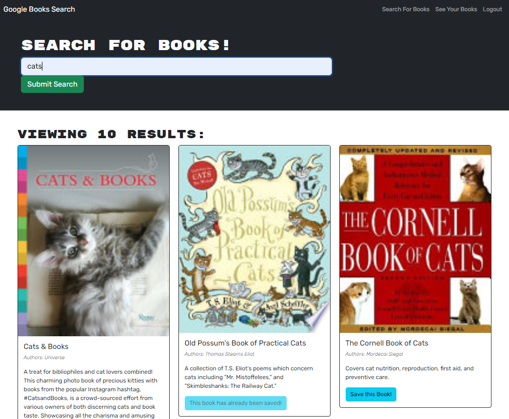
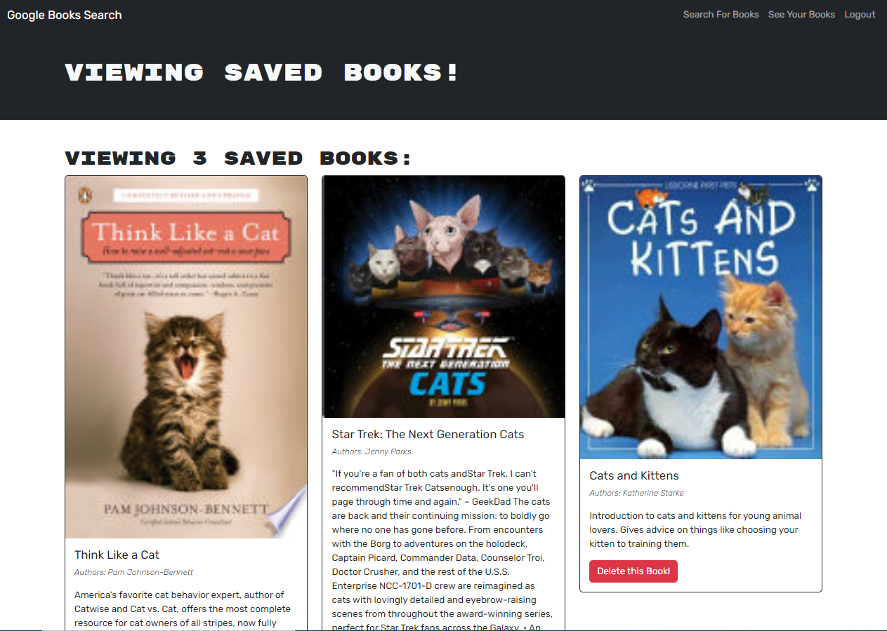

# book-search-engine
Refactoring a RESTful API search engine to be a GraphQL API built with Apollo Server.

## Link to Deployed App
[Amy Metheny React Portfolio](https://purple-donkey-wings.herokuapp.com/)

## Overview
* Refactored a fully functional RESTful API that used controllers to use and Apollo Server and GraphQL queries and mutations to fetch and modify data
* Built using the MERN (MongoDB, Express, React, Node) stack - React front-end, MongoDB database, Node.js/Express.js server and API
* Uses an Apollo Provider to communicate requests with an Apollo Server
* Uses JWT to assign a web token
* Deployed to Heroku

## Features/Specifications
* Users can search for books, but must be logged in to save selections to a saved books list
* Submitting information through the Signup modal saves user data to the MongoDB database
  * Passwords are encrypted using bcrypt before being saved to the database
  * Upon signup or login, the use is authenticated and assigned a JWT, which is saved to local storage for the duration of the session
* Once logged in, the user can search for books, see their saved books, and log out
* Use a keyword to search for books; the 10 most relevant results are returned
* The user can click a button to save a result to their saved books list
  * Once saved, the button will disable and let the user know that the title is already saved to their collection
  * The user can then navigate to their saved books list, which will be populated with their selections
  * Saved selections are stored in the database and will persist when the user logs out and logs back in
  * The user can click a button to remove a book from their saved books list

## Screenshots

### Login/Signup modal

### Search Books page

### Saved Books page

## License
This project is licensed under the MIT License - see the LICENSE.md file for details.

# Contact Me
Use the links below to view, follow, or send me a message through my GitHub, LinkedIn, or StackOverflow pages
- [GitHub](https://github.com/abmetheny)  
- [LinkedIn](https://www.linkedin.com/in/amy-metheny-8b1177276/)
- [StackOverflow](https://stackoverflow.com/users/21890121/amy)